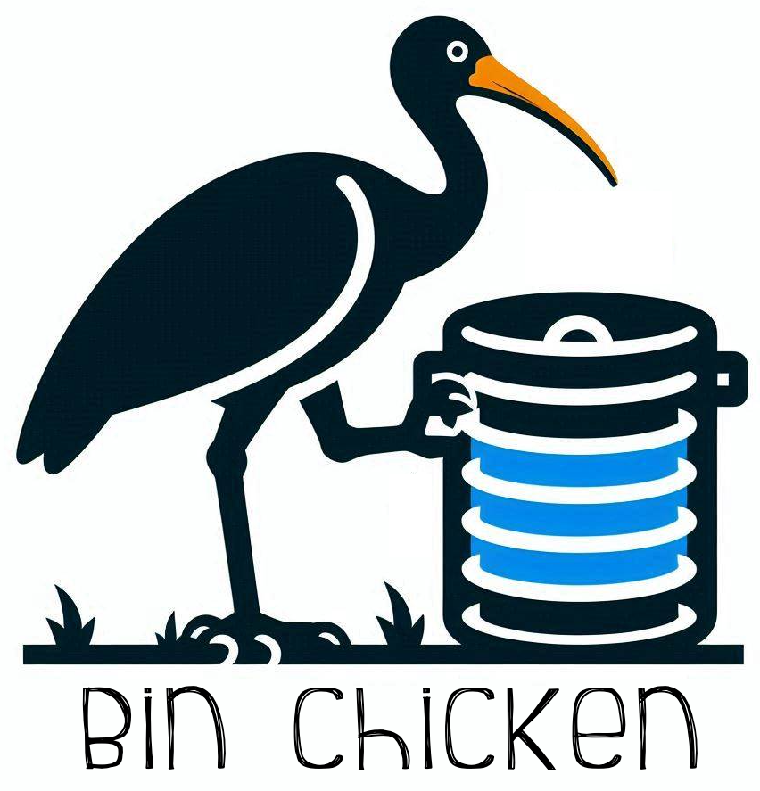

# Bin Chicken DB Library



## Overview
Bin Chicken is a simple yet effective Python library wrapping the [Ibis Library](https://ibis-project.org/) designed to help data scientists and engineers streamline their SQL-related tasks and enhance their workflow efficiency. Inspired by the needs outlined in a job posting from Reddit Data Science, this library aims to provide a foundational toolset for analyzing experiments, fetching data, building insights, and standardizing repeatable data science tasks.

### Naming

"Bin Chicken" is an Australian colloquial term to refer to the Australian White Ibis, due to its habit of eating from rubbish bins.

## Features

### 1. Analyze Experiments
- **Statistical Inference**: Includes built-in functions for state-of-the-art statistical analysis, enabling robust experiment analysis.
- **Visualization**: Tools to visualize data and results, aiding in the interpretation of experimental outcomes.

### 2. Fetch Data
- **Data Retrieval**: Functions to fetch data from up-to-date sources, ensuring you always work with the latest and most accurate information.
- **Database Connectivity**: Simplified connection and querying capabilities for various databases.

### 3. Build Insights
- **Data Processing**: Utilities for data cleaning, transformation, and aggregation.
- **Insight Generation**: Tools to build deeper insights and generate reports from Reddit data and other sources.

### 4. Standardize Analyses
- **Centralized Functions**: A collection of reusable functions to centralize and standardize common data science tasks.
- **Documentation**: Comprehensive documentation to help you understand and utilize the library effectively.

## Getting Started

### Installation
To install EvanPythonSQLTool, use pip:
```bash
pip install evanpythonsqltool
```


## Usage 

```python
import evanpythonsqltool as epst

# Connect to a database
db_connection = epst.connect_to_db('database_url')

# Fetch data
data = epst.fetch_data(db_connection, 'SELECT * FROM table_name')

# Analyze data
results = epst.analyze_experiment(data, method='t-test')

# Build insights
insights = epst.build_insights(data)

# Standardize analyses
standard_analysis = epst.standard_analysis(data)

```

## Things To Practice

- Pandas
- Python (Production Code)
- Python Testing 
- Python Virtual Environments (venv)
- Ibis
- SQL
- BigQuery SQL
- Airflow
